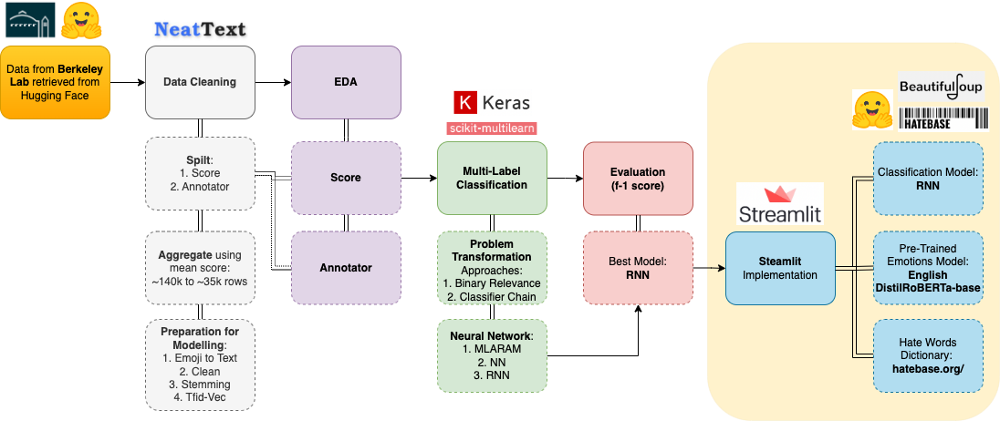

 

# Capstone: Project Elimi-'Hate'

## 1. Problem Statement

Recognising the adverse impact of hate speech worldview, the United Nations launched its [United Nations Strategy and Plan of Action on Hate Speech](https://www.un.org/en/genocideprevention/documents/advising-and-mobilizing/Action_plan_on_hate_speech_EN.pdf) campaign on 18 June 2019 with the mission to address the root causes and drivers of hate speech, and to enable effective responses to the impact of hate speech on societies. Part of its key commitments is to leverage on technology and to use education as a tool to counter and address hate speech. 

This project, titled **Project Elimi-'Hate'**, sees the potential of data science to combat against hate speech. In particular, with the rise of social media, the far-reaching damaging impact of hate speech is just one post away. Moreover, much existing efforts have been focused on censorship. While there is certainly a place for censorship, it is not a long term solution as users can always seek alternative platforms or different wordings to post hateful comments. Echoing the approach of UN, this project believes that much more can be done in the sphere of education to combat against hate speech. More specifically, this project aims to :-

1. **Increase empathy towards others in the social media space**; and 
2. **Cultivate better awareness of unhelpful written expressions.**

## 2. Dataset

The current project references to a dataset provided by the [Social Science Data Laboratory](https://matrix.berkeley.edu/research-center/social-science-data-laboratory-d-lab/) of University of California, Berkeley measuring hate speech. While it is possible to scrap data from various online social media platforms, labour for human annotating is expensive. The alternative of self-annotating is also time-consuming and biased. Hence, the project landed on the approach to reference to a robust dataset from a reputable institution.

Most descriptions of the dataset can found via the [hugging face website](https://huggingface.co/datasets/ucberkeley-dlab/measuring-hate-speech) and the [research paper published](https://arxiv.org/abs/2009.10277). Nevertheless, for those areas which the dataset is uncleared on, the project shall omit them from analysis (see under [dataset card](https://huggingface.co/datasets/ucberkeley-dlab/measuring-hate-speech): "This dataset card is a work in progress and will be improved over time.").

## 3. Approach

Using the dataset, the project seeks to produce a reliable multi-label classification model. The dataset will then be published online via [Steamlit](https://streamlit.io/). Existing resources, such as [Perspective API](https://perspectiveapi.com/) produced by Google, focus on screening out unhelpful comments. This project aims to do the opposite. Instead of tackling the hate speech from a receiver's point of view, the project's Streamlit API is meant to engage writers before they post any comment. 

Of course, there is no guarantee that such a service would be welcomed by many. Nevertheless, this project hopes that such a service will appeal to two groups of people :-

1. **Those who wants to err on the safe side**

Those who are sensitive to what they post online may appreciate a readily available platform to check their writings in order to avoid regrets or causing hurts to others. 

2. **Youths & Children**

More importantly, given the accessibility of social media today, youths and children in particular may not have the maturity to embrace these online social platforms. While treating others with respect and saying no to bullying should rightly be part of civic moral education, moral education should not contained within the walls of schools. This project seeks to bring education to where it is most needed, the social media platforms themselves. 

An overview of the project's approach is provided in the image below: 

## 4. Summary

The main objective of this project lies in the Streamlit API, which allows users to check their posts prior to submitting them online. The API can be assessed via this [link](https://soonpohchua91-streamlit-test-streamlit-app-j6eb7g.streamlit.app/).

The Streamlit API has three components in total:

### 4.1 Pre-Trained Emotion Model

Output of predominant emotion detected in the post by testing against the Hugging Face [Emotion English DistilRoBERTa-base](https://huggingface.co/j-hartmann/emotion-english-distilroberta-base?text=Oh+Happy+Day) pre-trained model returning an output of seven emotions (anger, disgust, fear, joy, neutral, sadness and surprise).

### 4.2 Trained Multi-Label Classification Model

Five models were tested. Below is a summary of the findings. 

Index | Model | Precision Macro Avg |  Recall Macro Avg | f-1 Macro Avg | Remarks | 
|:----:|:----|:----:|:----:| :----:| :----|
|1| Binary Relevance & Naives Bayes | 0.73 | 0.74 |0.70 | Assumed labels are not related to each other |
|2| Classifier Chain & Naives Bayes | 0.62 | 0.93 |0.74 | Produced good f-1 score at the expense of precision |
|3| MLARAM | 0.62 | 0.51 |0.53 | Registered bad scores across  |
|4| Neural Network | 0.56 | 0.79 |0.66 | Clear overfitting  |
|5| RNN | 0.71 | 0.82 |0.76 | Best Model based on f-1 score |

The RNN model registering the highest f-1 score of 0.76 was chosen as the model for Streamlit. In short, precision measures how well the model performs out of all predictions while recall measures how well the model performs out of all actual labels. Hence, in order to balance between eliminating false prediction and true labels not detected, f-1 score, which represents the harmonic mean of both precision and recall scores, is used to measure the effectiveness of each model.

### 4.3 Hate Words Detection

English word(s), which are thought to be offensive in nature, were scraped from the [Hatebase](https://hatebase.org/) website, a public repository of hate words across various languages.

### 4.4 Output

Taken together each of the components shall return three outputs for each post :
- Negative emotion detected in post;
- Negative label(s) detected in the post; and 
- Hate word(s) found in the post.

Using a tri-testing process, the API hopes to: 
1. pick out harmful posts for users to reconsider posting them; and/or 
2. raise awareness on hate words found within the post.

## 5. Limitation

Although the project managed to successfully deploy a workable API in hope to tackle the issue of hate speech, the following limitations are still present:
1. **Background of Dataset**: Data were gathered in United States and annotated by Americans.
2. **Important of Context in Language Usage**: The RNN attempted to draw relationship between words through vectorization technique. Given the complexity of language, it remains to be seen if a fixed approach is useful.
3. **Further Testing of Streamlit API**: API needs to be further tested in order to pick out discrepancies for future refinement.

## 6. Future Works

1. **Making API more accessible**: There is no guarantee that one would use the Streamlit API, which involves them exiting their browser, in order to check their posts. Deploying the API using a widget embedded within each specific social media platform seems to be a better solution moving forward.
2. **Incorporating Images**: Submitting posts on social media platforms does not merely involved words. There is potential for the project to include pictures submitted in conjunction with words.
